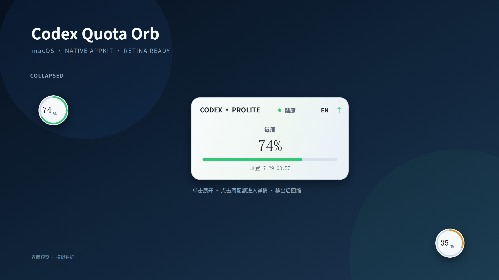
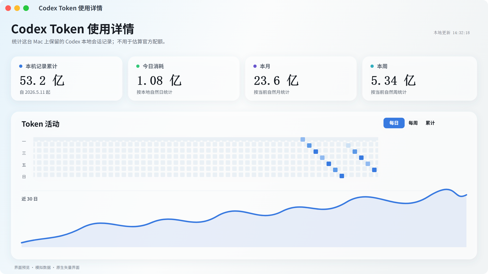
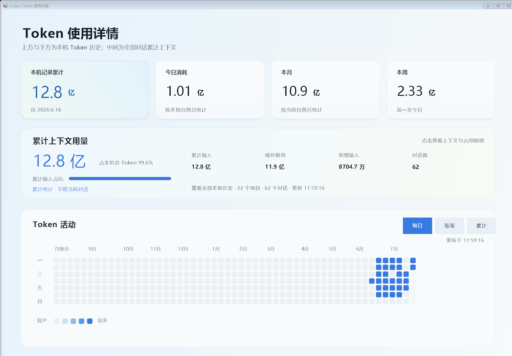
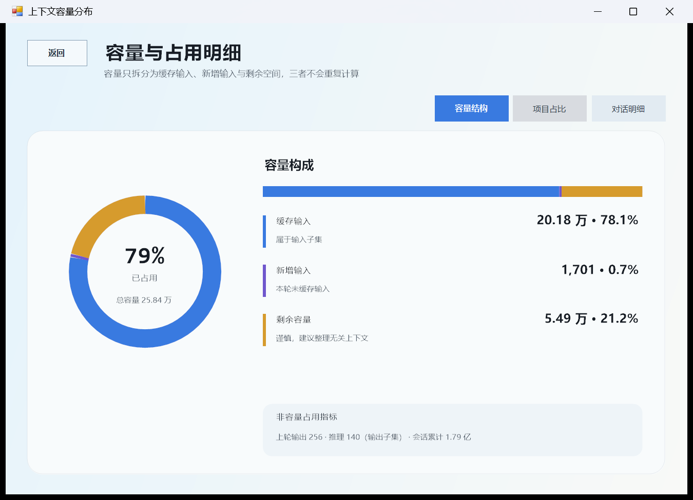

# Codex Quota Orb

一个轻量、原生、高分屏清晰的 Codex 配额浮球，支持 macOS 与 Windows。浮球只显示官方周剩余配额；单击展开重置时间，再点击周配额区域进入当前会话上下文容量与本机 Codex Token 使用详情。



> 图中为界面预览与模拟数据。真实配额只在本机读取，不会写入仓库。

## 下载

| 平台 | 安装包 | 系统要求 |
| --- | --- | --- |
| macOS | [Codex-Quota-Orb-macOS.dmg](https://github.com/huaxing1986q-png/codex-quota-orb/releases/download/v0.4.1/Codex-Quota-Orb-macOS.dmg) | macOS 13+，Apple Silicon / Intel |
| Windows | [Codex-Quota-Orb-Windows.zip](https://github.com/huaxing1986q-png/codex-quota-orb/releases/download/v0.4.1/Codex-Quota-Orb-Windows.zip) | Windows 10/11 |

两个安装包统一发布在 [`v0.4.1`](https://github.com/huaxing1986q-png/codex-quota-orb/releases/tag/v0.4.1)。

## 特点

- **低干扰**：静止时是 48pt/px 正圆小球，悬停不展开，单击才显示周配额卡。
- **准确口径**：官方周配额与本机 Token 历史完全分开，不用本地 Token 推算账户额度。
- **上下文容量**：显示当前活动会话的上下文占用、剩余、总容量、缓存复用、新增输入、上轮输出与推理明细。
- **整理提示**：上下文剩余 `≥ 50%` 为健康，`10–49%` 提示整理无关内容，`< 10%` 提示总结后新建任务。
- **三态清晰**：健康 `≥ 50%`、谨慎 `10–49%`、紧急 `< 10%`，颜色、文字和进度同步表达。
- **位置稳定**：默认右下角，可自由拖动；靠近屏幕边缘展开后，回缩仍返回原始浮球位置。
- **独立置顶**：置顶后不跟随 Codex 隐藏或最小化；关闭置顶后恢复跟随 Codex。
- **原生清晰**：macOS 使用 AppKit/Retina 矢量绘制，Windows 使用 Per-Monitor DPI V2 自绘。
- **无终端闪窗**：登录启动不弹出 PowerShell 或 Terminal 窗口。
- **本地优先**：不保存访问令牌、账户 ID、原始配额响应、提示词或聊天正文。

## 界面

| 浮球与配额卡 | Token 使用详情 |
| --- | --- |
|  |  |

| 当前上下文入口 | 下一层容量结构 |
| --- | --- |
|  |  |

展开卡仅包含：

- Codex 方案版本
- 每周剩余配额
- 每周重置时间
- 中英文切换
- 始终置顶

已取消的 5 小时板块不会显示。点击整块周配额区域即可打开详情，不增加入口图标。

详情页中的上下文容量以当前活动会话最新一条 `token_count` 数值事件为准：

- 总容量：`model_context_window`
- 当前占用：最新请求的 `input_tokens`
- 缓存复用：`cached_input_tokens`，属于输入子集
- 新增输入：输入减去缓存复用
- 上轮输出：`output_tokens`
- 推理：`reasoning_output_tokens`，属于输出子集
- 会话累计：当前会话的累计 Token；不与上下文容量相除

点击详情页中的整块“当前会话上下文”区域，会进入下一层“容量与占用明细”：

- **容量结构**：缓存输入、新增输入、剩余容量及其百分比
- **项目占比**：按会话 `cwd` 聚合每个本地项目，显示路径、Token、总占比和对话数
- **对话明细**：每个 JSONL 会话按 Token 从大到小排列，显示总占比、项目内占比和最后活动时间
- **返回**：点击文字键“返回”或按 `Esc` 回到上一层 Token 详情

暖色用于标出大容量项目和对话。项目路径与会话 ID 只在内存中即时解析，不写入历史缓存；对话名称使用日期与短会话 ID，不读取聊天正文生成标题。

## 交互

1. 单击圆球：展开周配额卡。
2. 右击圆球：显示原生菜单；选择“退出插件”即可彻底结束当前浮球进程。
3. 悬停圆球：保持圆球，不自动展开。
4. 点击周配额区域：打开同一进程内可复用的 Token 详情窗口。
5. 点击上下文容量区域：进入容量结构、项目占比和对话明细；“返回”或 `Esc` 回到上一层。
6. 鼠标移出卡片或点击桌面：自动回缩。
7. 拖动圆球或卡片：保存圆球锚点；展开时的屏幕避让坐标不会覆盖它。
8. 置顶关闭：仅在 Codex 位于前台或从浮窗回到桌面时显示。
9. 置顶开启：独立常驻，不再跟随 Codex。

## 平台

| 平台 | 实现 | 要求 | 状态 |
| --- | --- | --- | --- |
| macOS | Swift 5.9 + AppKit | macOS 13+，Apple Silicon / Intel | DMG 安装包 |
| Windows | PowerShell + C# WinForms | Windows 10/11 | ZIP 便携包 |

### macOS

详细构建、安装和登录启动说明见 [`macos/CodexQuotaOrb/README.md`](macos/CodexQuotaOrb/README.md)。

本机构建：

```bash
cd macos/CodexQuotaOrb
chmod +x scripts/*.sh
./scripts/build-app.sh
```

输出：

```text
dist/Codex Quota Orb.app
dist/Codex-Quota-Orb-macOS.dmg
```

安装到当前用户并设置登录启动：

```bash
./scripts/install-launch-agent.sh
```

### Windows

下载并解压 [`Codex-Quota-Orb-Windows.zip`](https://github.com/huaxing1986q-png/codex-quota-orb/releases/download/v0.4.1/Codex-Quota-Orb-Windows.zip)，在解压目录运行：

```powershell
powershell.exe -NoProfile -ExecutionPolicy Bypass -File .\Install.ps1
```

安装器会复制文件到 `%LOCALAPPDATA%\CodexQuotaOrb`、设置当前用户登录启动，并以无控制台窗口方式启动。若只想便携运行，直接双击 `Start Codex Quota Orb.vbs`。

Windows 完整安装、卸载和隐私说明见 [`windows/README-Windows.md`](windows/README-Windows.md)。

源码直接启动：

```powershell
powershell.exe -NoProfile -ExecutionPolicy Bypass `
  -File .\scripts\CodexMonitor.ps1 -Mode Start
```

离线解析自检：

```powershell
powershell.exe -NoProfile -ExecutionPolicy Bypass `
  -File .\scripts\CodexMonitor.ps1 -Mode SelfTest
```

当前真实配额：

```powershell
powershell.exe -NoProfile -ExecutionPolicy Bypass `
  -File .\scripts\CodexMonitor.ps1 -Mode Usage
```

## 数据来源

| 显示位置 | 数据来源 | 含义 |
| --- | --- | --- |
| 浮球 / 周配额卡 | `https://chatgpt.com/backend-api/wham/usage` | 账户官方周剩余量和重置时间 |
| 当前上下文容量 | 当前活动会话最新 `token_count` 数值事件 | 最新请求输入占用、模型上下文容量及结构明细 |
| 项目 / 对话占比 | `session_meta` 的会话 ID、`cwd` 与每个会话的数值 Token 累计 | 本机项目和独立对话的详细占用量 |
| Token 详情页 | `~/.codex/sessions` 与 `~/.codex/archived_sessions` | 当前电脑保留的 Codex 会话 Token 历史 |

配额解析优先按真实周期 `604800` 秒识别周窗口，避免被 `primary` / `secondary` 等字段名误导；兼容 `remaining*`、`used*`、比例和百分数格式。上游未返回可信周窗口时显示不可用，不从其他周期猜测。

上下文容量只读取当前活动会话的最新数值记录，不读取消息正文；占用率为最新 `input_tokens ÷ model_context_window`。项目和对话明细只读取 `session_meta` 中的会话 ID 与工作目录，再与数值 Token 累计关联。Token 历史按本地自然日聚合，缓存只包含文件指纹和每日数字总量，不包含项目路径、会话 ID、上下文明细或消息内容。

## 刷新与准确性

- UI、鼠标退出和前台状态：每 250ms 检查。
- 官方配额：通常每 30 秒校准；重置前 15 分钟每 10 秒。
- 本地会话变化：750ms 合并连续写入后触发刷新。
- 详情窗口打开时：最多每 10 秒校准上下文与 Token 历史；手动刷新最短间隔 1 秒。
- 官方请求最短间隔：2 秒。
- 临时网络失败：最多保留最近 30 分钟的成功值，并明确显示为不可用/过期状态。

“实时”受官方配额服务发布时间、网络和本地会话落盘时间限制。本项目不会伪造比上游更快的新数值。

## 隐私边界

- 只读取现有 Codex Desktop 登录态。
- 访问令牌只发送给上述 ChatGPT 配额端点。
- 不保存令牌、账户 ID、请求头或原始响应。
- 不保存提示词、消息正文、工具输出或原始会话事件。
- 不兑换重置机会，不修改账户设置，不含遥测。

## 验证

- Windows：`CodexMonitor.ps1 -Mode SelfTest`
- macOS：`CodexQuotaOrb --self-test`
- GitHub Actions（macOS）：在真实 macOS runner 上完成 Swift 编译、自检、`.app` 和 `.dmg` 打包。
- GitHub Actions（Windows）：在真实 Windows runner 上完成配额解析自检和 ZIP 便携包构建。

## 参考

产品信息结构、色彩方向与隐私边界参考了 [change-42-yhmm/quota-float](https://github.com/change-42-yhmm/quota-float)。本项目使用独立的 AppKit 与 WinForms 实现；第三方许可说明见 [`THIRD_PARTY_NOTICES.md`](THIRD_PARTY_NOTICES.md)。

## License

[MIT](LICENSE)
